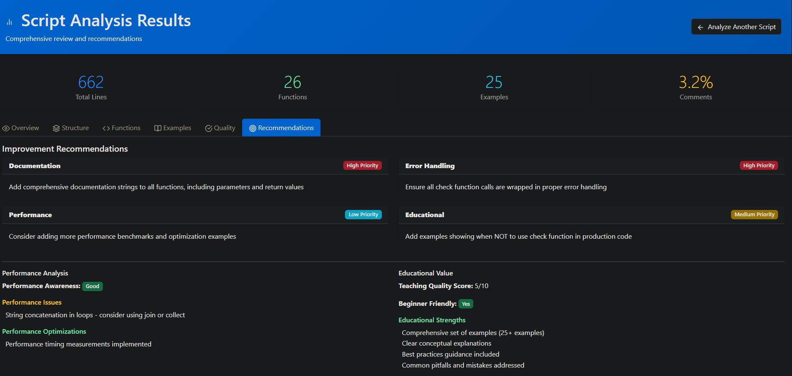

# Rebol 3 Script Analysis Tool

A comprehensive web-based tool for analyzing and reviewing Rebol 3 scripts with detailed feedback and recommendations.

## Features

- **Comprehensive Analysis**: Analyzes code structure, functions, examples, documentation, and best practices
- **Educational Assessment**: Evaluates the educational value and learning progression of scripts
- **Performance Analysis**: Identifies performance considerations and optimization opportunities
- **Interactive Web Interface**: Clean, responsive Bootstrap-based UI
- **Detailed Reporting**: Multi-tab analysis results with metrics and recommendations
- **Sample Scripts**: Built-in sample script loader for testing



## Installation

### Prerequisites

- Python 3.7 or higher
- pip (Python package installer)

### Setup Instructions

1. **Download and extract** the project files to your desired location

2. **Install Python dependencies**:
   ```bash
   pip install flask
   ```

3. **Run the application**:
   ```bash
   python app.py
   ```

4. **Open your web browser** and navigate to:
   ```
   http://localhost:5000
   ```

## Usage

1. **Paste Script Content**: Copy and paste your Rebol 3 script into the text area
2. **Load Sample**: Use the "Load Sample Script" button to test with a sample
3. **Analyze**: Click "Analyze Script" to perform comprehensive analysis
4. **Review Results**: Navigate through the analysis tabs to review detailed feedback

## Analysis Categories

The tool provides analysis in the following areas:

- **Overview**: Script metadata, line counts, and structure overview
- **Structure**: Function distribution, organization score, and documentation ratio
- **Functions**: Function analysis including complexity, documentation, and error handling
- **Examples**: Educational value assessment and example quality evaluation
- **Quality**: Code quality metrics, best practices adherence, and recommendations
- **Recommendations**: Specific suggestions for improvement

## File Structure

```
rebol-analyzer/
├── app.py                 # Main Flask application
├── analyzer.py            # Core analysis engine
├── templates/
│   ├── index.html        # Main upload page
│   └── analysis.html     # Analysis results page
├── static/
│   └── style.css         # Custom styling
└── README.md             # This file
```

## API Usage

The tool also provides a REST API endpoint for programmatic access:

```bash
curl -X POST http://localhost:5000/api/analyze \
  -H "Content-Type: application/json" \
  -d '{"script_content": "your rebol script here"}'
```

## Sample Script

The application includes a built-in sample script demonstrating proper `check` function usage with error handling and documentation. Use the "Load Sample Script" button to test the analyzer.

## Development

To modify or extend the analyzer:

1. **Core Analysis Logic**: Edit `analyzer.py` to add new analysis patterns or metrics
2. **Web Interface**: Modify templates in the `templates/` directory
3. **Styling**: Update `static/style.css` for visual customizations
4. **Flask Routes**: Add new endpoints in `app.py`

## Requirements

- Flask web framework
- Python standard library (re, collections, typing)
- Modern web browser with JavaScript enabled

## License

This tool is provided as-is for educational and development purposes.

## Support

For issues or questions about the analysis tool, please review the code comments and documentation strings within the source files.
